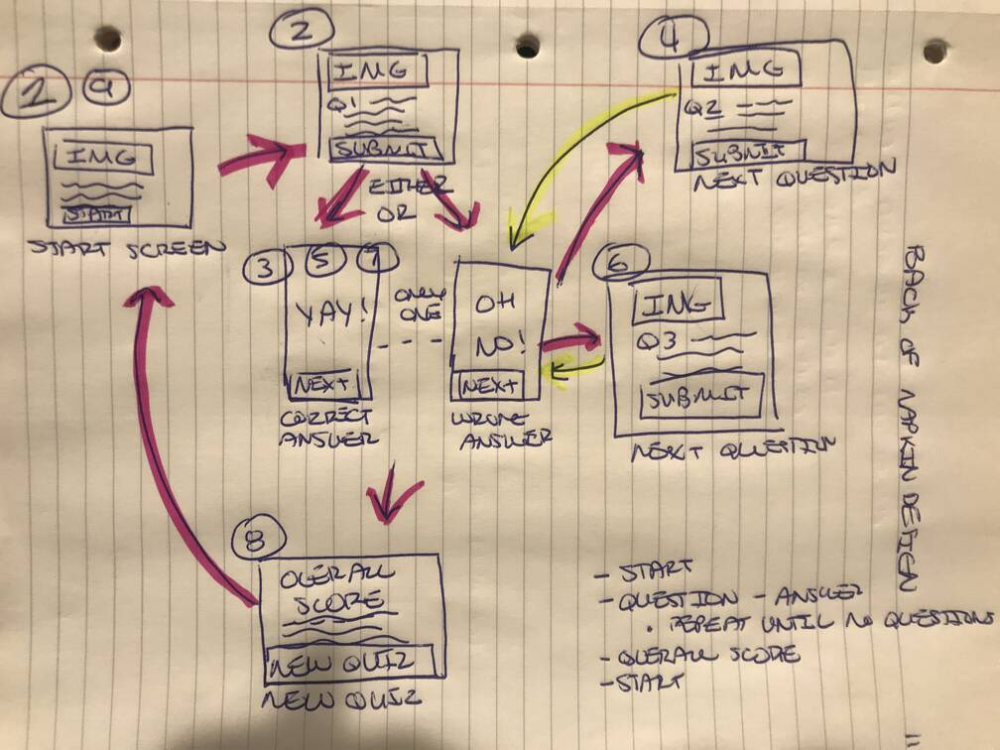

# Boilerplate app structure for Quiz App project

## Back of Napkin Design

## User Stories

**Starting Screen**
- The app should have a starting screen.
- When a user clicks the 'start quiz' button, it should start the quiz/show the first question.

**Changing Questions**
- User should be prompted through a series of at least 5 multiple choice questions to answer.
- Each question should be asked one at a one.
- User should only be prompted with 1 question at a time.

**Displaying Information**
- The user should be able to see what question number they are on out of the total number of questions. "7 out of 10".
- The user should be able to see the number of correct and incorrect questions updating as they go. "5 correct, 2 incorrect"

**Submitting Answer**
- When a user submits an answer, they should receive either confirmation or a message saying they were incorrect with the correct answer.
- When a user submits an answer, they should be moved on to the next question or interact with an element to move on.
- At the end of the quiz, user should be shown their overall score at the end of the quiz.
- User should be able to start a new quiz at the end of the quiz.

## Images
Image Source: https://media.snl.no/media/135506/article_topimage_Frank_Ocean.jpg

